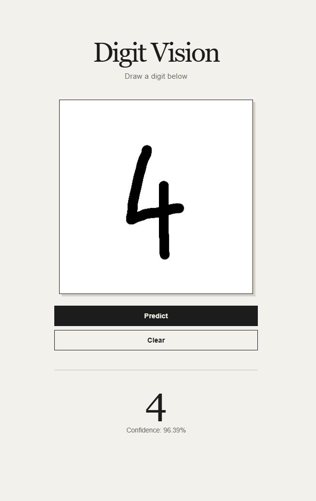

# Digit Vision

A full-stack handwritten digit recognition application built with PyTorch, FastAPI, React, and TypeScript.

The project uses the MNIST dataset to train a convolutional neural network and provides a web interface where users can draw digits and receive predictions.

## Demo

Draw a digit on the canvas and the application sends the image to the FastAPI backend, preprocesses it, runs the CNN, and returns the predicted digit with its confidence.

## Machine Learning

### Dataset

MNIST — 28×28 grayscale handwritten digits with 10 classes (0–9).

### Models

A simple neural network was first implemented as a baseline:

- Baseline accuracy: 97.04%

A convolutional neural network was then developed:

- Parameters: 50,186
- Initial CNN accuracy: 98.89%
- Best validation accuracy after hyperparameter tuning: 99.09%
- Final validation accuracy: 99.07%

Hyperparameters explored included learning rate, batch size, convolutional channels, and dropout.

## Tech Stack

**ML:** Python, PyTorch, Torchvision, NumPy, Pandas

**Backend:** FastAPI, Uvicorn, Pillow

**Frontend:** React, TypeScript, Vite, HTML Canvas

**Development:** Git, GitHub, VS Code

## Project Structure

    digit-vision/
    ├── api/
    ├── data/
    ├── ml/
    │   ├── notebooks/
    │   └── models/
    ├── ui/
    ├── requirements.txt
    └── README.md

## Running Locally

### Backend

    .venv\Scripts\Activate.ps1
    pip install -r requirements.txt
    uvicorn api.main:app --reload

The API runs on http://127.0.0.1:8000.

### Frontend

    cd frontend
    npm install
    npm run dev

## Current Limitations

The model performs very well on MNIST, but real user drawings are not identical to MNIST images.

The current pipeline resizes the entire 400×400 canvas directly to 28×28. This means digit size, position, and proportions can differ significantly from the training data.

Improving this preprocessing pipeline is the main next step.

## Roadmap

- [ ] Improve image preprocessing
- [ ] Detect and crop the digit
- [ ] Preserve aspect ratio
- [ ] Center the digit
- [ ] Deploy the application

## Version

Current release: **v1.0.0**

v1.0.0 represents the first complete end-to-end version of the project:

- Dataset and EDA
- Baseline model
- CNN
- Hyperparameter tuning
- Error analysis
- Model export
- FastAPI inference API
- React frontend
- Interactive drawing canvas
- End-to-end prediction

## Goal

The goal of Digit Vision is to understand the complete process of taking a machine learning model from experimentation and training to a usable full-stack application.